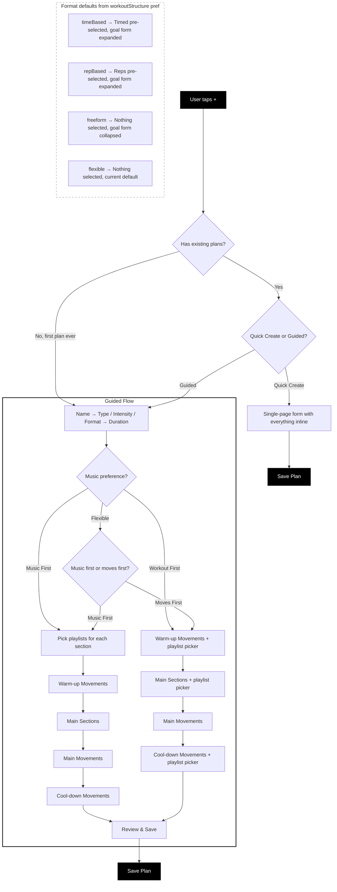

# Plan Creation — Conditional Flows

Diagram of the varying paths a user can take when creating a plan, based on their preferences set during onboarding.

## Three Conditionals

### 1. Rep/Time/No Base Default (workoutStructure preference)
| Preference | FORMAT pill in Step 2 | Movement form behavior |
|---|---|---|
| timeBased | "Timed" pre-selected | Goal form expanded, seconds input |
| repBased | "Reps" pre-selected | Goal form expanded, reps input |
| freeform | Neither selected | Goal form collapsed, "Assign reps/time" link |
| flexible | Neither selected | Same as current default |

Users can always override the pre-selection.

### 2. Music First vs Moves First (musicApproach preference)
- **workoutFirst**: Current flow — playlist pickers inline below movements
- **musicFirst**: Dedicated "Pick Your Music" step after Duration; read-only playlist labels during movement steps
- **flexible**: Choice step asking "Music First or Moves First?" then branches accordingly

### 3. Experience-Based Quick Create
- First plan ever → always guided flow
- Returning users (≥1 plan) → choice between Guided and Quick Create
- Quick Create = single scrollable page with everything inline
